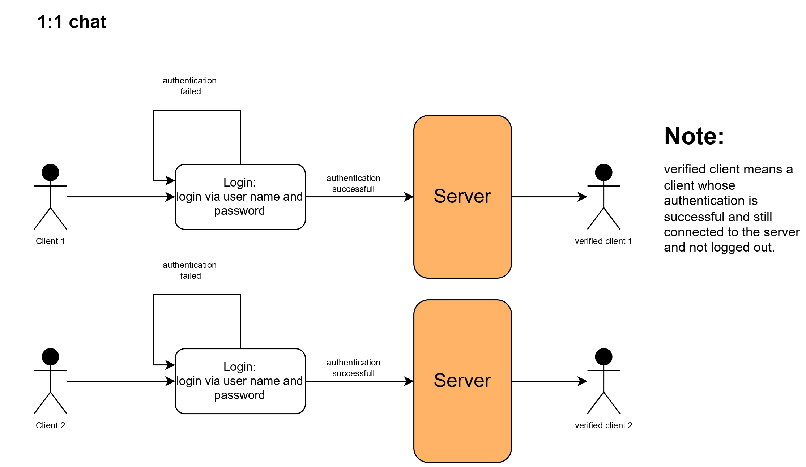
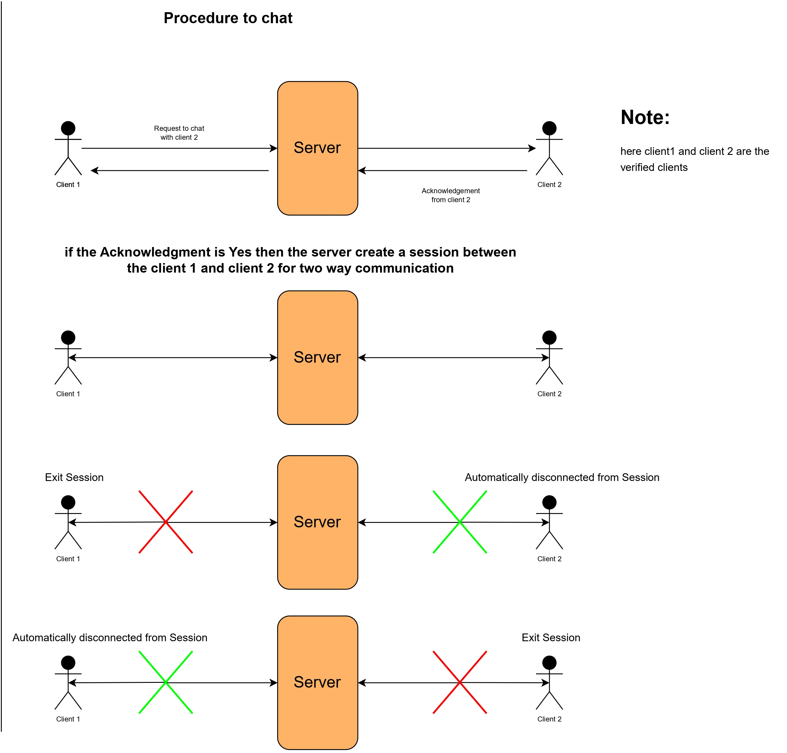
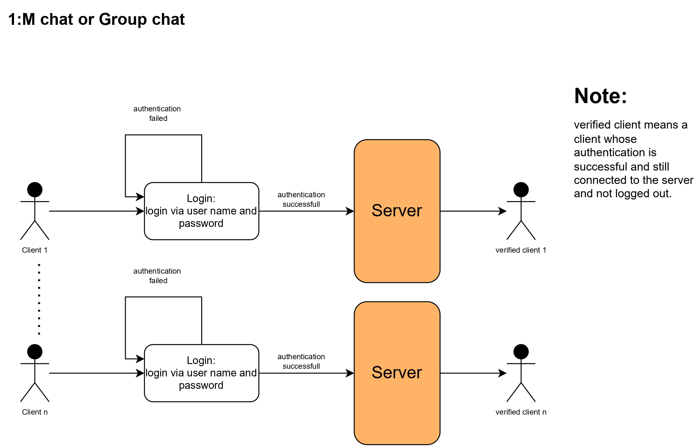
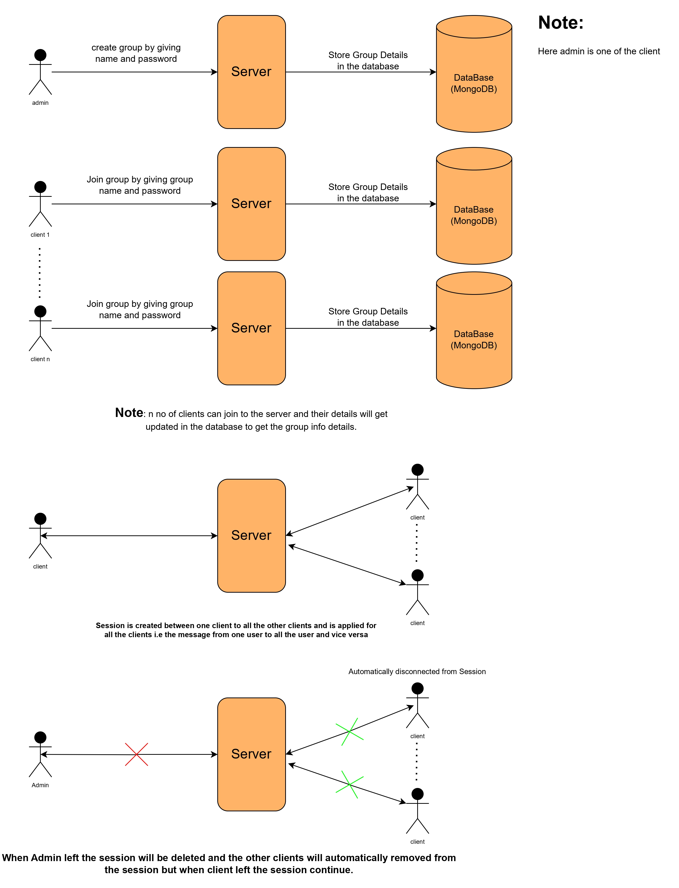
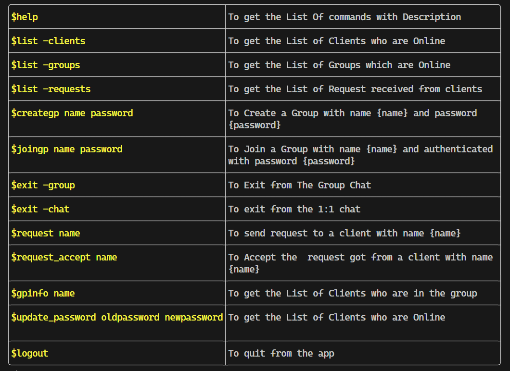

# Assessement-1:

## App Execution:

## List of Commands with use cases and syntax:

**Modes:**

There will be three modes in the app

1. shell mode
2. chat-1:1 mode
3. group mode.

> In specific group respective commands will get executed.

once the user enter the chat mode the shell and group commands are not visible.

Note:

> when user disconnected from the one to one session the other user will also get disconnected.

> in Group session when user disconnected from the session total group will be disconnected.
